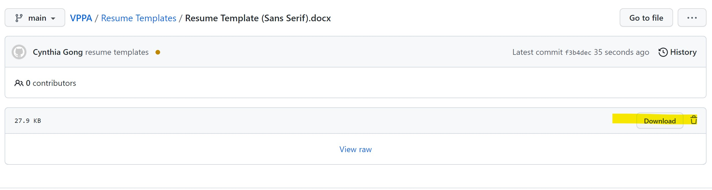

# **SEP PROFESSIONAL HUB**

**Welcome to the home of all things professional at SEP!**

This is where you will find resources to help you secure your next internship or full time job.

## **Interview Prep**

| Industry | Repository Link |
| --- | --- |
| Consulting | [Link](https://github.com/cynthiagong/VPPA/tree/main/Consulting) |
| Finance | [Link](https://github.com/cynthiagong/VPPA/tree/main/Finance) |
| PM | [Link](pm.md) |

## **Additional Resources**

**Note**: To download files, click on the download button -- it is highlighted in the image below.

| Resource | Link |
| --- | --- |
| Resume Templates | [Link](https://github.com/cynthiagong/VPPA/tree/main/Resume%20Templates) |
| Cover Letter Templates | Coming Soon! |
| Cold Email Guide | Coming Soon! |
| International Student Guide | [Link](international.md)

## **Online Subscriptions**
We are excited to launch online resources for all of SEP members! This is still in the works, so please reach out to us with requests for any additional subscriptions.

| **Website** | **Link** | **Username** |
|---|---|---|
| LeetCode Premium | [Link](https://leetcode.com/accounts/login/?next=/subscribe/) | TBD |
| Coursera | [Link](https://www.coursera.org/?authMode=login) | TBD |

 
 
 
 
 
created with ❤️ by your favorite corporate cog