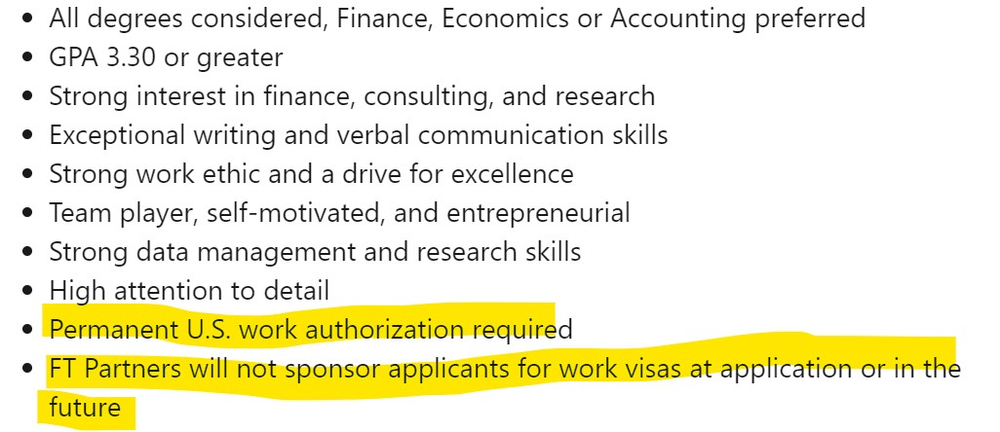

# [<- Go Back to Homepage](home.md)

Special thank you to Avnish for the information on this page!

For international students studying in the US, the process for applying to internships and jobs requires a few more steps. 

During the internship/job hunt, the number one thing to keep an eye out for is that the company *sponsors international students*. Usually the job description will clarify if the company will sponsor. The picture below is an example of something to look out for:

In this example, the company would not sponsor applicants and thus would not be feasible for international students.

After you secure your offer, there still are additional steps you need to take in order to properly proceed with the internship/job. 

| Step # | Description |
| --- | --- |
| **1.** | Enroll in a 195 Contract Course. Every department should offer this course -- check with your major/department advisor if you need help with this. For instance, if you are in the School of Engineering, you would enroll in ENGR 195.|
| **2.** | For 195 Contract Courses, you typically will need to fill out a contract form that will ask for an offer letter and a letter from the employer meeting these requirements: ***number of weekly internship hours, period of internship (start and end dates), outline of internship responsibilities, name, title, and contact info for internship supervisor, and the letter must be signed by internship supervisor of human resources.***  |
| **3.** | Apply for a new I-20 with CPT approval from Dashew. [Here](https://internationalcenter.ucla.edu/file/91b9a5a3-cda5-42ac-8402-6c17932c7c91) are the guidelines Dashew has for the process. |
| **5.** | CPT Request form can be found [here](https://internationalcenter.ucla.edu/file/b8b19dc4-67b0-468e-8abb-9311825781b2). |
| **6.** | From the Dashew website: To apply for CPT, please submit a completed CPT Request Form and a copy of your employement/internship offer letter ***(must be issued on company letterhead and include: start date, end date, number of hours per week, and description of job duties demonstrating direct connection to student's major and degree level)*** to dcissf1unit@saonet.ucla.edu |
| **6.** | After you get your new I-20 and you are sucessfully enrolled in a 195 course, you will want to apply for a SSN (Social Security Number) if you don't already have one. Dashew has a guide [here](https://internationalcenter.ucla.edu/resources/social-security-number), whil UCLA has also provided a guide [here](https://www.finance.ucla.edu/tax-records/tax-services/how-to-apply-for-a-social-security-number). |
| **7.** | Once you have a SSN and all the above are done, you can sign your I-9 which will typically be  handled by your employer. Then you're all good to go! |

One more thing to note; make sure to do these steps as soon as possible and to not delay the process on your end. If your I-20 isn't accepted in time or your I-9 hasn't been completed by your company's request date, it is highly likely for your internship to be cancelled. 

If there are any other questions you might have, it is best to visit the Dashew Center as they have numerous resources to assist with the process.